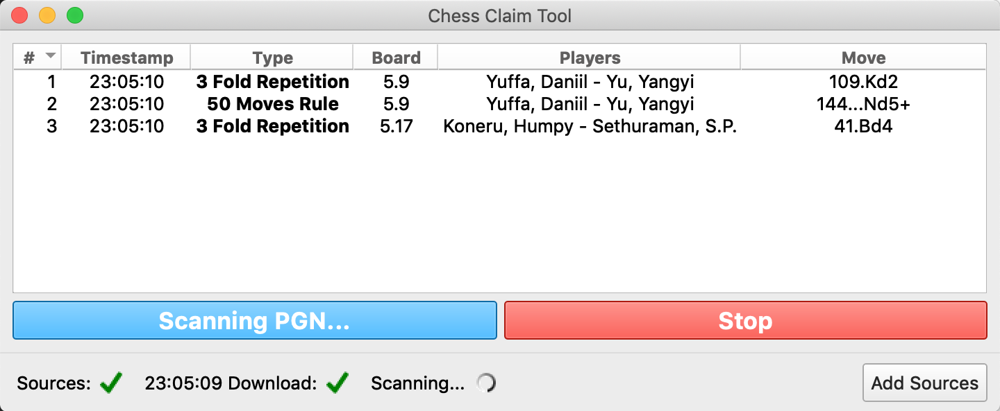

<a href="https://www.buymeacoffee.com/thansernt" target="_blank"></a>
# Introduction

According to the official FIDE Regulations in some special cases, a game of chess could end in a draw either by a claim of the player or by the intervention of the arbiter.
These cases are:

- 3 Fold Repetition(claim by player)
- 50 Moves Rule (claim by player)
- 5 Fold Repetition (arbiter should intervene)
- 75 Moves Rule (arbiter should intervene)

_Detailed explanation: [FIDE Laws of Chess - Article 9](http://www.fide.com/fide/handbook.html?id=208&view=article)_

The idea behind this program is to perform checks <b> in real-time updating pgn</b> for these claims and help the arbiters intervene accordingly.

This will be especially useful for tournaments where the games are recorded with the [DGT Livechess software](http://www.digitalgametechnology.com/index.php/products/electronic-boards/serial-tournament/285-dgt-livechess-software13?mavikthumbnails_display_ratio=2) (or any other similar software).

The program is meant to work using either local pgn files and/or pgn files from the web. This means that is an independent tool from the live game's operator, and can be used like football VAR by the arbiters.

# Disclaimer

This tool is **not** officially approved by FIDE. The arbiter can consult the tool, but should always act as the FIDE Laws of chess mandate when a claim is made.

### Tool Accuracy

The tool uses the [python-chess](https://github.com/niklasf/python-chess) external library to detect possible claims. The accuracy of the tool should be 100%. Until now, there are no reports of missed or incorrect claims made by the tool.

# Operating System

This version is compatible with the macOS and Windows.

**Download installation packages** through the release page: [https://github.com/Dedekind125/chess-claim-tool/releases](https://github.com/Dedekind125/chess-claim-tool/releases)

# Dependencies

- Python 3
- PyQt 5
- [python-chess](https://github.com/niklasf/python-chess) by Niklas Fiekas
- [Windows-Toasts](https://github.com/DatGuy1/Windows-Toasts)

# Usage

The program should start by running the main.py

```
$ python main.py
```

## Screenshots

Here is how the GUI looks like (on macOS) while the program is running:



